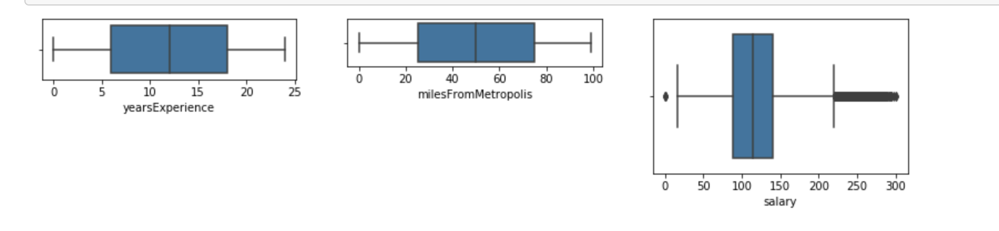
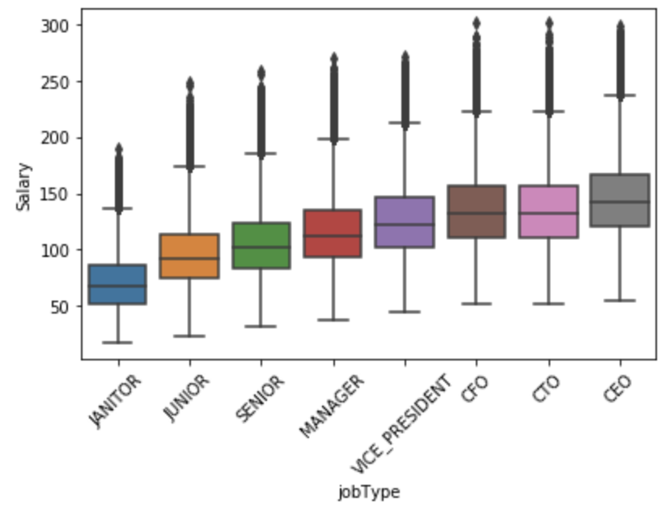
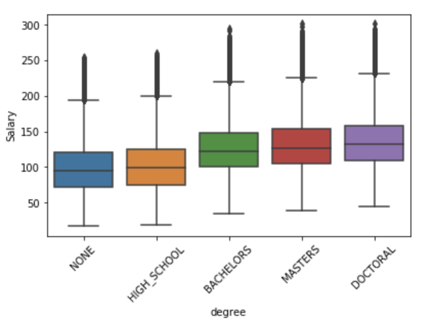
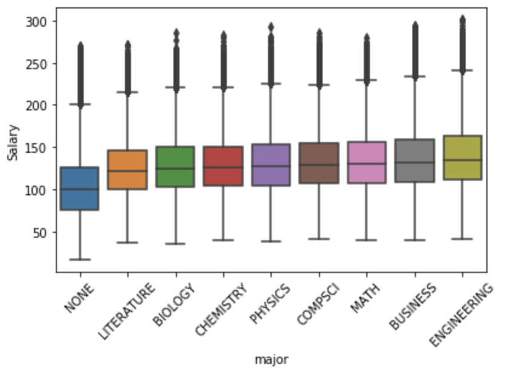
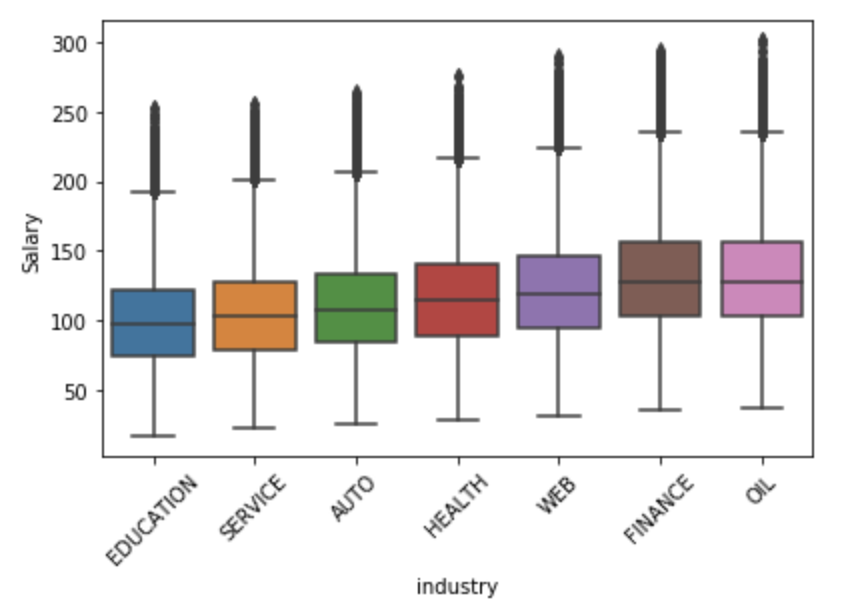
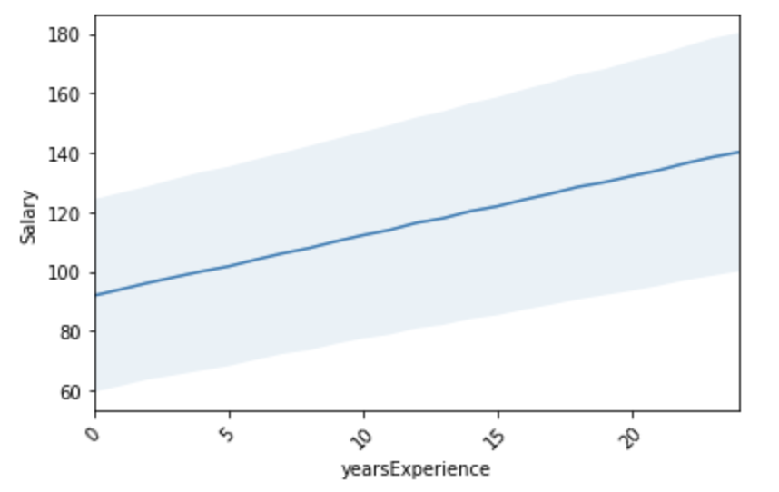
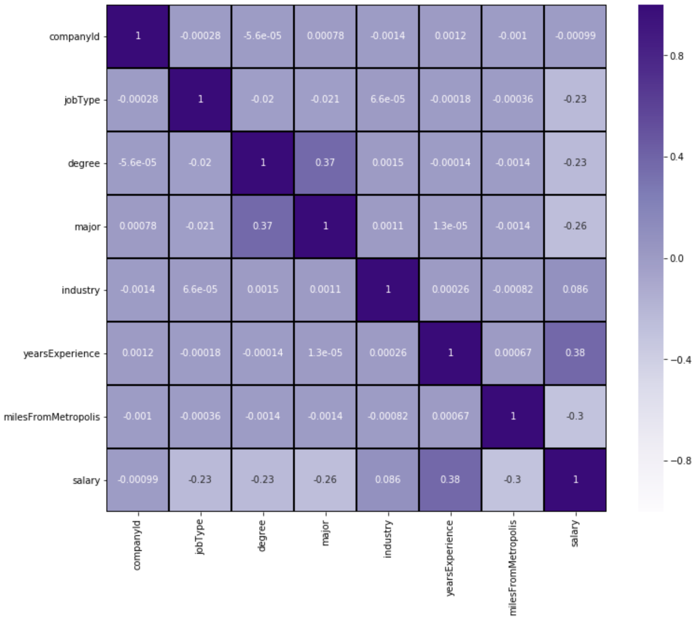

# SALARY PREDICTION PROJECT 

**Application deployed :** [Click to see APPLICATION ](https://salarypredictionapplication.herokuapp.com/ "Application")

# DEFINE

## Project Goal:
The goal of this project is to examine the dataset of job postings, and predict salaries for a new set of postings. - This will involve building a model to predict the salaries given in the test dataset.

##  Practical use:
HR Department of a large company or a Consulting groups that needs real-time solutions in order to make effective employment offers to potential hires.

It also finds use in getting to understand current realities in the job market and how businesses can leverage this in order to secure high quality talent, while keeping recuritment cost low.

The primary tool used for this project is Python 3, along with an extensive array of libraries and packages available for the manipulation of data,and development of predictive modeling algorithms.

# DISCOVER

### Data loading
- Received data having 2 .csv files
    - 1st contains job features
    - 2nd contains salaries for each job.
- In both sheets, JobID is common column.
- Import both files and merge them into one single dataframe with reference to jobID.

### Data Understanding
- JOB TYPE - Janitor, Manager, CEO, CFO etc.
- DEGREE - High school, College, Master's etc.
- MAJOR - Physics, Biology, Maths etc.
- INDUSTRY - Health, Finance, Oil etc.
- YEARS_OF_EXPERIENCE - Candidate experience in years
- MILES_FROM_METROLPOLIS - Distance from the metropolis
- Every row(job) has a unique JOB_ID, there is a column, COMPANY_ID which is the company identifier.

### Clean Dataset - Observatios & Outcomes
- There are zero rows negative values in all numeric columns.
- Years of Experience can be zero for fresher also Miles From Metropolis can be zero who live in city.
- But, There are 5 invalid entries in salary column and all having value 0 which is not expected.
- Hence need to handle those 5 values

### Exploratory Data Analysis (EDA)
- Target feature is Salary column rest others will be independent features (we exclude jobID, companyID features as they are unique identity key)
- Except salary colum other two features having median and mean close to each other
- Salary:
        - Mean is greater than median shows its right skewed/ positive sekwed and contains outliers

- As we can see above 3 visualizations in box plot "SALARY" column having outliers
- Remove the outliers rows from the dataset, as there are only 5 rows out of 1 million datarows we can delete
- So basically use formula: outside 1.5 times the interquartile range above the upper quartile and below the lower quartile (Q1 - 1.5 IQR or Q3 + 1.5 IQR).

## Correlation between 2 features to see corelation.

**1. Salary vs JobType**
- Salary vs Job type : jobtype is highly correlated with salary.
- As jobtype or position is increase salary is increase

**2. Salary vs Degree**
- Salary vs Degree: Degree is correlated with salary.
- As degree is high salary is also high.
- But, for bachelors, masters and doctoral, median salary is same.
- It's true after several years in organisation and getting promoted to higher position salary increase.

**3. Salary vs Majors**
- Salary vs major: major is correlated with salary.
- But, for business, engineering, CompsCi, maths salary is more.

**4. Salary vs Industry**
- Salary vs Industry: Industry is correlated with salary.
- Maximum salary have in Finance and Oil industry.

**5. Salary vs YearsOfExperience**
- Salary vs Years Experience: yearsExperience is correlated with salary.
- As years of experience is more the salary is more, data match with real life scenarios.

**6. Overall Correlation between features**
- As there is an strong correlation between
    - YearsExperience and salary
    - Degree and major

## Prepare data for modelling.
- From above observations it is found that all features correlated with salaries.
- Hence we use all columns for machine learning (except JobID and CompanyID as they are identifier columns).

**Handle Categorical Column Values**
--------- Overall 4 Categorical Columns in dataset ---------
- There are 8 categories in jobType
- There are 5 categories in degree
- There are 9 categories in major
- There are 7 categories in industry
- It means total 29 dummies will be created
- We use sklearn.get_dummies() method and remove one category from each category to avoid dummies trap.
- Hence, total 25 new features(dummies) will be created.
- Already there are 6 column out of which 4 categorical and 3 integer
   - 3 integer columns + 25 dummies
   - Hence, total 28 features will be there.
**Data is ready now for machine learning development**

# DEVELOPMENT

**Establish BASELINE model**
- As XGboost is very popular for regression problem
- Hence, i am taking XGBoost as base model.
- Perform 5-fold cross-validation to check RMSE.
- The basemodel provides **RMSE 432.200** score
- We try to minimise this base score in future development.

**Try below machine learning models**
- We applied train and test dataset on below machine learning models we get RMSE.
- LinearRegression :         **386.860**
- RandomForestRegressor:     **374.888**
- Lasso:                     **397.296**
- GaussianNB:                **9863.773**
- DecisionTreeRegressor:     **439.996**
- GradientBoostingRegressor: **366.328**

_Here **GRADIENT BOOSTING REGRESSOR** give good performance as compare to others (Best Model)**

**Perform HyperParameter Tunning**
**Step 1. Randomize Search CV:**
- Provide below best parameters for dataset. We train model with this parameters.

- _GradientBoostingRegressor(learning_rate=0.05, max_depth=5, max_features='sqrt',
                          n_estimators=1100, subsample=1)
- After training model we found **RMSE 358.97**

**Step 2. Grid Search CV:**
- Update Randomize Search CV parameter and applied to GridSearchCV and train model.
- _GridSearchCV(cv=5, estimator=GradientBoostingRegressor(), n_jobs=-1,
             _param_grid={'learning_rate': [0.05], 'max_depth': [5],
                         _'max_features': ['sqrt'],
                         _'n_estimators': [900, 1000, 1100, 1200, 1300],
                         _'subsample': [1]},
             _verbose=2)
- After training model we found **RMSE 358.54**

- We get our best model with RMSE score of 358.
- Now we are ready to move next step of deployment the model.

# DEPLOYMENT
- For deployment of model i performed below steps.
    - 1. Implement an application using python FLASK framework to build UI.
    - 2. Deploy on the Heroku cloud platform.
    
- Structrue of application and deployment requirements.
    - ![Artifacts/Folder] (https://github.com/GDhasade/SalaryPredictionMLProject/tree/master/artifacts)
        - model_code.ipynb : python code notebook 
        - model pickle file
    - ![Template/Folder] (https://github.com/GDhasade/SalaryPredictionMLProject/tree/master/templates)
        - index.html file for Frontend
        - .css file for UI formating
    - ![Python Server] (https://github.com/GDhasade/SalaryPredictionMLProject)
        - app.py : The python Flask application work as **server** handle all input and output between UI and model.
        - Requirement.txt: Contains all packages used for modelling. File require while deploying application on cloud.

